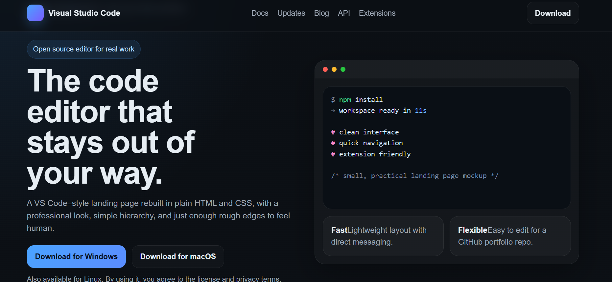

# VS Code Landing Page Clone

A responsive landing page inspired by the official Visual Studio Code website, built using pure HTML and CSS.

## 🚀 Features
- Clean and modern UI
- Fully responsive layout
- Dark theme design
- Smooth scrolling experience
- Structured sections (Navbar, Hero, Features, Footer)

## 📸 Screenshot

## 🛠️ Tech Stack
- HTML5
- CSS3

## 📂 Project Structure

## 🔗 Live Demo
https://swastikjha008-jpg.github.io/vscode-landing-page-clone/

## 🎯 Purpose
This project was built as part of my web development learning journey to strengthen my understanding of layout, styling, and responsive design.

## 🔗 Inspiration
https://code.visualstudio.com/

## ⚠️ Note
This is an independent project inspired by the original VS Code website. It is not an official clone.

---

⭐ If you like this project, feel free to star it!
